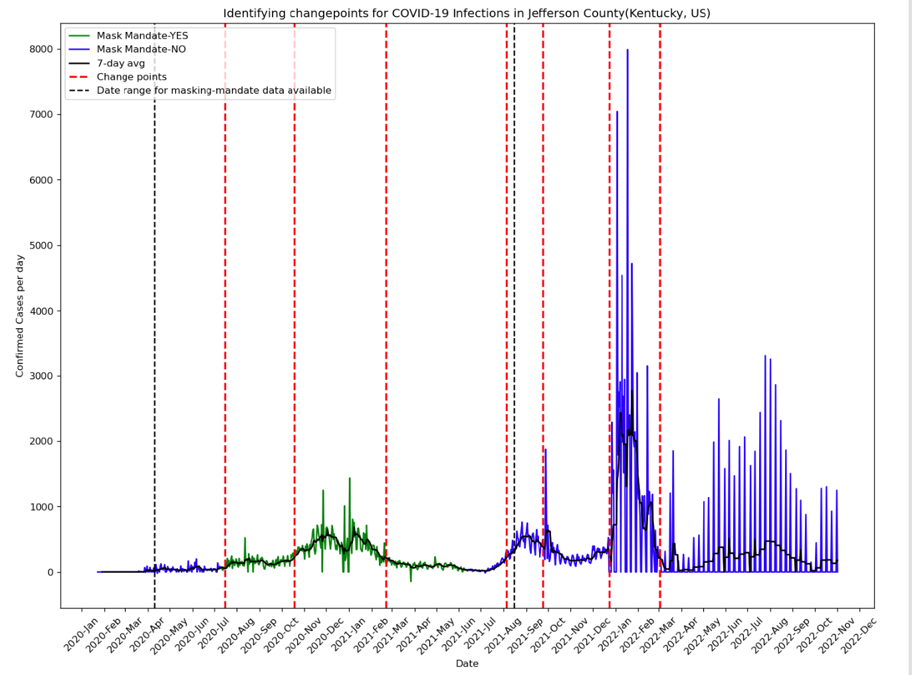

[](https://github.com/DAVFoundation/captain-n3m0/blob/master/LICENSE)
 


# Impact Analysis of human mobility and government interventions effects on the spread of COVID-19
County Assigned: Jefferson County (Kentucky, US)


## Goal

The COVID-19 pandemic has greatly affected people’s lives, world economies, and the public health threat it represents is the most serious seen in a respiratory virus since the 1918 H1N1 influenza pandemic. In the absence of a vaccine or an effective treatment, the rapid spread of the disease elicited a wide range of responses from different governments across the globe to contain the spread of the pandemic. It is well known that the US government had also adopted several interventions apart from the mask mandate policy like travel restrictions, ban on large gatherings, stay-at-home orders, etc., to determine the set of restrictions that will effectively help remediate the spread of COVID-19 without excessively limiting the economic activity. However, these policies did have severe public repercussions. These non-traditional restrictions caused social belonging, quality of education, human needs of safety, and financial security to be threatened.  Hence, it's essential to understand which government policies which include pharmaceutical and non-pharmaceutical inventions, had a positive turnaround in containing the spread and were truly worth implementing. This analysis can help the policymakers get more insights on what measures can be quickly implemented/ adjusted in the future if a similar situation were to arise, so as to ensure that the general public is not subjected to restrictions that perhaps don't yield the intended results.

Human mobility also plays an important role in the dynamics of infectious disease spread. By analyzing social mobility data, one can evaluate if changing social mobility in outdoor or indoor settings along with masking policies influenced COVID-19 infection spread in real-time as well. One of the motivations for this exercise is to understand if tracking human mobility both inclusive and exclusive of periods where mask mandates policies were in effect, through publicly available data sources can be used as an effective measure in identifying patterns in the COVID-19 spread.

The Kentucky state government (like other state governments) has implemented several policies at different time periods to help reduce the spread. However, it can be possible that the population responds differently to government interventions and that these differences can cause different human mobility patterns which leads the epidemic development to change. Hence, human mobility is a good additional factor that can also be used to evaluate the effectiveness of pharmaceutical and non-pharmaceutical inventions when analyzing the spread of COVID-19.

The main motivation of this analysis is to truly understand the effects of government interventions and human mobility on the spread of COVID-19 and to identify how these interventions and human mobility, in general, had a significant impact in reducing the COVID-19 spread in Jefferson County, Kentucky, US.

## Research questions
Below are the set of Research questions and Hypothesis the study tries to answer. (All the questions listed before are pertaining to Jefferson County, KY)
1) How has mobility changed with the government restrictions and policies in place?
Hypothesis:
Null: The mean difference in the percentage change in mobility prior to and post-mask mandates is not different from 0.
Alternative: The mean difference in the percentage change in mobility prior to and post-mask mandates is different from 0.

2) Which of the different government responses/policies have influenced mobility the most?
Hypothesis: 
Mobility (of a particular type, say mobility to drug stores or pharmacies) reduced by X% post a varied combination of government policy implementation on the travel ban, masking regulations, and vaccination mandates

3) Which of the different government responses/policies have influenced the COVID-19 spread the most?
Hypothesis: 
COVID-19 cases reduced by X% post a varied combination of government policy implementation on the travel ban, masking regulations, and vaccination mandates

4) How have different mobility habits influenced the spread of the COVID-19 pandemic? Has reduction/increase in mobility had a significant impact on case reduction/increase?
Hypothesis: 
A time lag correlation between the different types of human mobility and the covid-19 cases, identifies the mobility contributions towards the spread.


## Data Utilized/ Input files

Data Source 1: [COVID-19 Data from John Hopkins University ](https://www.kaggle.com/datasets/antgoldbloom/covid19-data-from-john-hopkins-university?select=RAW_us_confirmed_cases.csv)

This dataset consists of the cumulative confirmed case counts were gathered from the Kaggle repository of the John Hopkins University; Raw United States confirmed COVID-19 cases dataset. 


Data Source 2: [U.S. State and Territorial Public Mask Mandate from April 10, 2020, through August 15, 2021, by County by Day](https://data.cdc.gov/Policy-Surveillance/U-S-State-and-Territorial-Public-Mask-Mandates-Fro/62d6-pm5i) 

This dataset consists of the data for masking mandates was sourced from the CDC dataset of masking mandates by county. 
and  the mask-use-by-county.csv dataset is the New York Times [mask compliance survey](https://github.com/nytimes/covid-19-data/tree/master/mask-use) data.
 

Data Source 3: [COVID-19 Mobility dataset from Google](https://github.com/GoogleCloudPlatform/covid-19-open-data/blob/main/docs/tablemobility.Md)

The dataset shows how visits to places, such as grocery stores, public transport hubs, and parks, to name a few, have changed since Feb 2020 compared to a baseline. The baseline is the median value, for the corresponding day of the week, during the 5-week period Jan 3–Feb 6, 2020. 

Data Source 4: [Covid-19 Government Response dataset from the University of Oxford](https://github.com/GoogleCloudPlatform/covid-19-open-data/blob/main/docs/tablegovernment-response.md )

This dataset consists of the government's response to the pandemic through different policies like school closures, restrictions on travel/ internal movement, and workplace closures, to name a few, including a stringency index associated with each government response.


## Repository Distribution

```
data-512-homework_1/
  |- README.md
  |- LICENSE
  |- data
    |- RAW_us_confirmed_cases.csv
    |- mask-use-by-county.csv
    |- U.S._State_and_Territorial_Public_Mask_Mandates_From_April_10__2020_through_August_15__2021_by_County_by_Day.zip
  |- Part 1- Jupyter notebook.ipynb
  |- Part 1- Collective Analysis - Reflection Statement.pdf
  |- Part 1- Collective Analysis - Visualization Explanation.pfd
  |- Visualization.png
```

## Jupyter Notebooks

Part 1- Jupyter notebook.ipynb : Contains the code used for analysis and plotting of the visualization for common analysis

Part2- Extensive Analysis.ipynb: Contains the code used for analysis and plotting of the visualizations needed for the extensive analysis to access the impact Analysis of human mobility and government interventions effects on the spread of COVID-19


## Issues/ Special considerations
1) Moving average (over 7 days) of the daily cases counts data also incorporated in the analaysis and visualization approach to account for case counts not being updated for every single day in a week to help smooth out-trend information by creating a constantly updated average value in the visualization.
2) Apart from the CDC masking mandate data, Jefferson County's official website stating the masking policies have also been considered in the output visualization.
3) The COVID-19 Mobility dataset demonstrates how visits to sites like grocery shops and parks have altered (during the pandemic) from a pre-pandemic baseline value. The baseline is the median value on the relevant weekday from January 3 to February 6, 2020. As time passes and we move further away from the baseline period, Jefferson County populations might vary due to relocation or new regional and remote working options. Google’s understanding of categorized places might also have changed. For example, the same value today and in April 2020 might not indicate the same behavior or adherence; it might be that Google has updated information about shops and restaurants in the region or that fewer people live there now. These differences could shift the values up or down over long time periods. Here, I would like to highlight that this potential variation in the population over time which in turn affects the changes in the mobility change rates is not considered during my analysis due to a lack of information on new baselines at different periods during the pandemic.
4) Also note that the inclusion of Google data in the computation of mobility changes is dependent on user choices, connection and if it fulfills Google's privacy limits. As a result, when the data does not match Google's quality and privacy requirements, there may be empty entries for specific locations and dates. It's also worth noting that this data is based on users who have enabled Location History in their Google Accounts, thus it reflects a sample group of users from any given region. As with all samples, this may or may not accurately represent the behavior of a larger population. 


## Human-Centered Considerations

All of the methodological methods discussed below are human-centered in nature. To begin, the proposed study design is oriented toward individuals. It uses human mobility behaviors to make decisions, which are subsequently utilized to promote policy health care, and government mandates improvements for the public. It employs data created by individuals for people. It also employs a participatory design in which data from users' inquiries is blended into the created answer in real-time. This immediate, quick, and low-cost feedback will help in the proactive updating of policy suggestions based on people's activities. Certain ethical issues are also included in this analytical process. It is based on data from Jefferson County inhabitants and is free of any other demographic biases. To protect people's privacy, no personal information or particular search searches are used in the study. The approach and analysis developed are also replicable and can be used for any data set containing people's mobility patterns and COVID-19 region responses.


## Findings


For Common Analysis



For research question: 1) How has mobility changed with the government restrictions and policies in place?


## Author
- [Shubha Changappa Palachanda](https://github.com/shubha8196)
